# gitOperations

# Step 1: Create New Repositery
  Step 1.1: Click New 
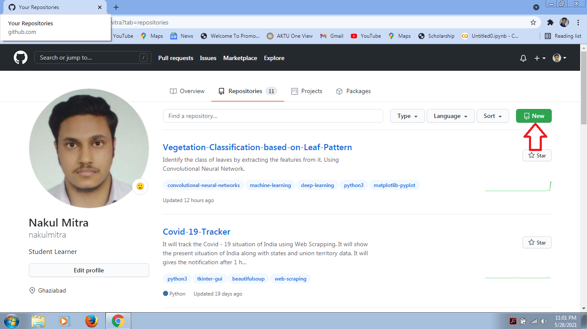

  Step 1.2: Give Repositery a name and click Create
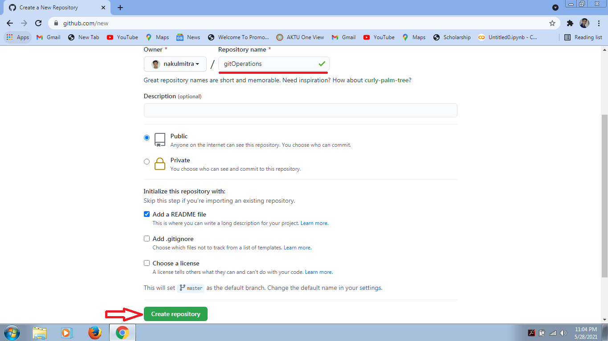

  Step 1.3: Copy the repositery link
  Code --> Copy repositery link

# Step 2: If your git bash is not configure with your github

$ git config --global user.name "Abc Xyz"

$ git config --global user.email abcxyz@example.com

# Step 3: Go to the folder where you want to make your local repositery
$ cd folderPath

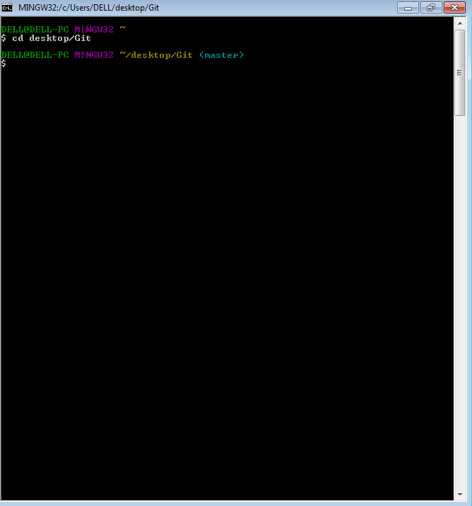

# Step 4: Clone repositery
$ git clone pasteRepositeryLink
Local Repositery will be created.

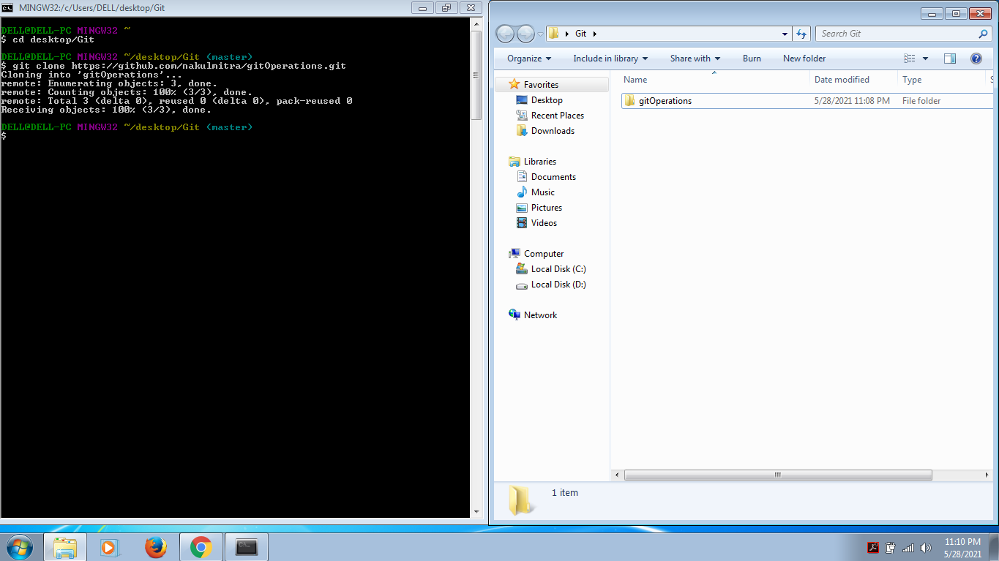

# Step 5: Go to local repositery
$ cd localRepositeryName

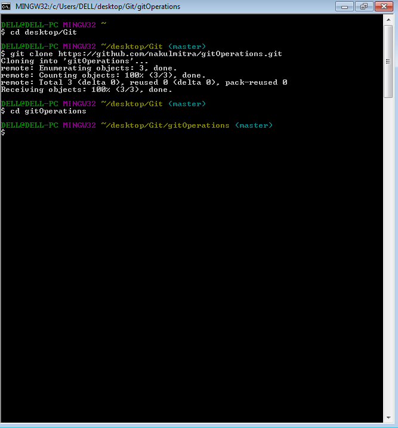

# Step 6: Do changes on local repositery

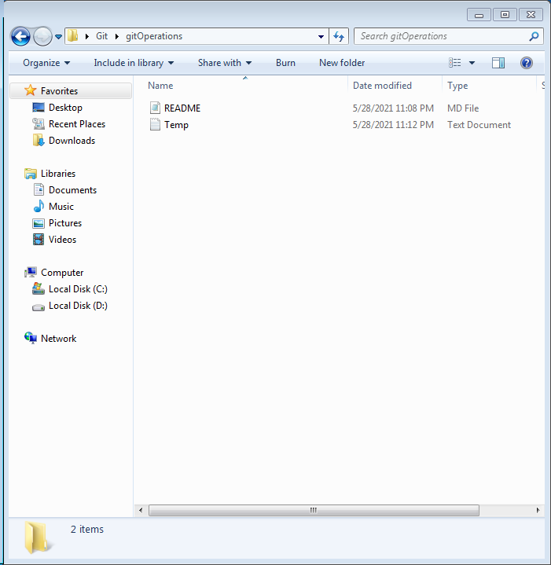

# Step 7: Add files to Staging state
$ git add .
Above command is used to add all the files to stage tree
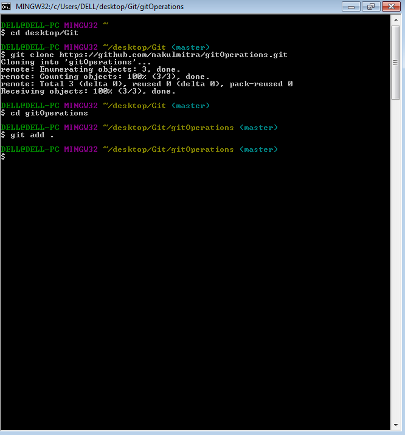

# Step 8: Check the status of add files
$ git status
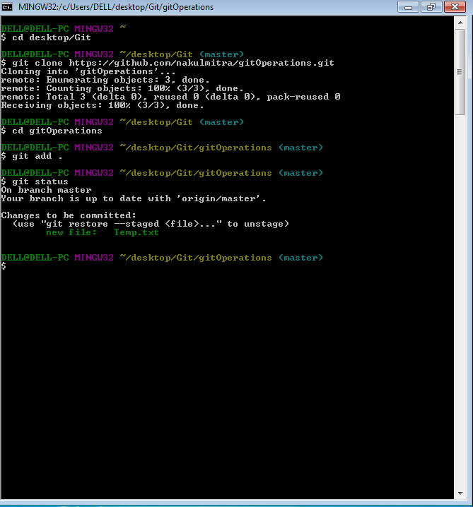

# Step 9: Commit the changes
$ git commit -m "Message"

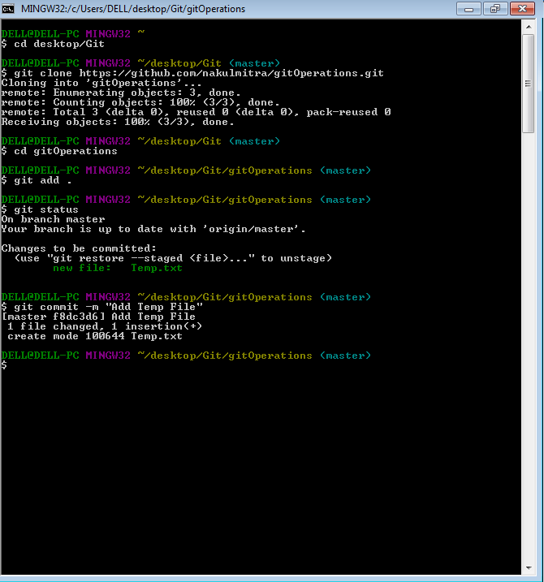

# Step 10: Push changes of local repositery to github repositery
$ git push origin branchName
Make sure pointer should points to that particular branch.

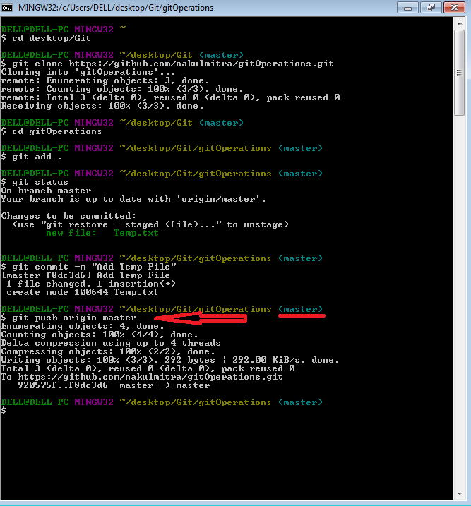

# See the changes

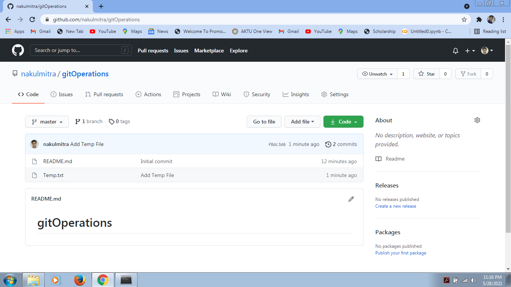

 