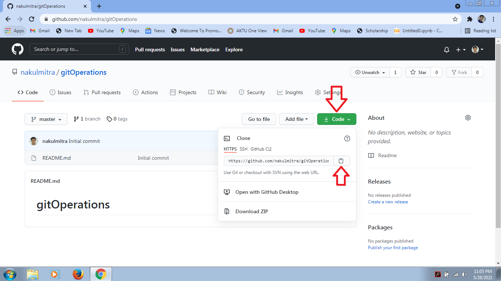

# gitOperations

# Step 1: Create New Repositery
  Step 1.1: Click New 

  Step 1.2: Give Repositery a name and click Create

  Step 1.3: Copy the repositery link

  Code --> Copy repositery link

# Step 2: If your git bash is not configure with your github

$ git config --global user.name "Abc Xyz"

$ git config --global user.email abcxyz@example.com

# Step 3: Go to the folder where you want to make your local repositery
$ cd folderPath

# Step 4: Clone repositery
$ git clone repositeryLink

Local Repositery will be created.

# Step 5: Go to local repositery
$ cd localRepositeryName

# Step 6: Do changes on local repositery

# Step 7: Add files to staging area
$ git add .

Above command is used to add all the files to staging area.

# Step 8: Check the status of add files
$ git status

# Step 9: Commit the changes
$ git commit -m "Message"

# Step 10: Push changes of local repositery to github repositery
$ git push origin branchName

Make sure pointer should points to that particular branch.

# See the changes

# Some other operations

# Remove File
$ git rm fileName

# See the Commit History of particular file
$ git log -- fileName  

# Recover the Deleted File
$ git checkout hashCode(first 5 characters) -- fileName

# Make New Branch
$ git branch branchName

# Change Branch
$ git checkout branchName 

# See All Branches
$ git branch

# Delete Branch
$ git branch -d branchName  

 